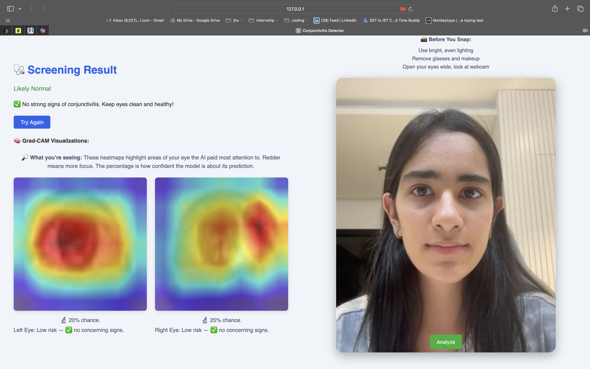

# 👁️ Eyedentify-AI: Conjunctivitis Detection Using Deep Learning  
**🚧 Status:** In Progress — Expected Completion: End July, 2025
Update: Completed MVP on July 24, 2025!

**Eyedentify-AI** is a tool that classifies red eye (conjunctivitis) from patient-submitted images. It combines image preprocessing, signal-based blur detection, and deep learning-based classification.  
The goal is to build a fully functional and explainable AI workflow — from raw images to web deployment — tailored for real-world use.

---

## ✨ 6 week Progress Highlights

| Component                                   | Skills Applied                                   |
|---------------------------------------------|--------------------------------------------------|
| Repository & environment setup              | GitHub, virtualenv, modular project structure    |
| Exploratory preprocessing    | Jupyter, pandas, OpenCV, Matplotlib              |
| Dataset split & double-eye handling     | pandas, scikit-learn                             |
| FFT-based blur detection & logging          | NumPy, frequency-domain analysis, CSV I/O        |
| Custom ResNet18 eye-crop model   | Roboflow annotation, PyTorch |
| Data filtering & versioned logs             | pandas, automated pipelines                      |
| Grad-CAM++ visualization                    | `pytorch_grad_cam`, PIL, Matplotlib              |
| Flask prototype & webcam capture (old_webcam)| Flask, MediaPipe, JavaScript                     |
| Responsive UI & loading indicators          | HTML/CSS, JS, CSS animations                     |

---

## 🔭 Planned Next Steps

- 🧠 **Integrate ResNet18** into the Flask app for live inference  
- 🎨 **Embed Grad-CAM++** overlays in the web UI  
- 📱 **Polish front-end**: responsive layout, progress bar, error handling  
- 🗂️ **Patient portal**: login, history, symptom timeline  
- 🔄 **Retrain & augment** with expanded dataset & cross-validation  
- 📦 **Deployment**: Docker container, CI/CD pipeline, cloud hosting  
- 📝 **Finalize docs** & prepare for submission/publication  

---

## 🛠️ Tech Stack

| Layer             | Technologies                                         |
|-------------------|------------------------------------------------------|
| **Data & EDA**       | Python, OpenCV, NumPy, pandas, Matplotlib            |
| **Detection**        | MediaPipe, ResNet18, Roboflow annotations           |
| **Classification**   | PyTorch, Torchvision (ResNet18)                      |
| **Explainability**   | Grad-CAM++ via `pytorch_grad_cam`                    |
| **Web Interface**    | Flask, MediaPipe, HTML/CSS, JavaScript                |
| **State & Storage**  | SQLite or JSON files for session & log tracking       |
| **DevOps**           | Git, virtualenv, Docker, CI/CD (GitHub Actions)      |

---

## Folder Structure

    .
    ├── .vscode/
    │   └── settings.json            # VS Code workspace settings
    ├── data/
    │   ├── raw/                     # Original patient images
    │   ├── filtered/                # Images that passed blur & quality filters
    │   ├── flagged/                 # Images flagged for manual review
    │   ├── processed/               
    │   └── split/            
    ├── eyedentify-ai-app/           # Flask web app (see its own README)
    ├── logs/
    │   ├── blurry_images.csv        
    │   └── filtered_images.csv      
    ├── notebooks/
    │   ├── 01_explore_preprocess.ipynb  # Image stats & blur detection
    │   ├── 02_split_double_eyes.ipynb   
    │   └── 03_Cropping_Model.ipynb      
    ├── plots/
    │   ├── fft_sharpness_histogram.png  # Sharpness distribution by class
    │   └── gradcam_visualizations.png   # Sample Grad-CAM++ heatmaps
    ├── resnet_weights/
    │   └── resnet18_weights.pth      # Trained ResNet-18 checkpoint
    ├── runs/                         
    ├── scripts/
    │   ├── gradcam.py                # Standalone Grad-CAM++ visualization script
    │   └── old_webcam.py             # Legacy webcam-capture demo
    ├── utils/
    │   ├── __pycache__/              # Python cache (auto-generated)
    │   └── preprocessing.py          # Resize, normalize, blur–filter functions
    ├── .gitignore                    # Files/folders to ignore in Git
    ├── conjunctivitis.zip            # Raw dataset
    ├── README.md                     # This file: project overview & structure
    └── requirements.txt              # `pip install -r requirements.txt`


---

## Conjunctivitis Web App

Here’s the end‐to‐end screening pipeline:

```mermaid
flowchart TD
    A["Capture webcam image"] --> B@{ label: "Click ANALYZE" }
    B --> C["MediaPipe detects eye regions"]
    C --> D["Preprocess: resize to 224×224 & normalize"]
    D --> E["ResNet18 inference → P(infected)"]
    E --> F{"P(infected) ≥ 60%?"} & K["Generate Grad-CAM++ heatmap"]
    F -- Yes --> G["Likely Conjunctivitis"]
    F -- No --> H{"P(infected) ≥ 40%?"}
    H -- Yes --> I["Near threshold: monitor or consult"]
    H -- No --> J["Likely Normal"]
    K --> L["Overlay heatmap & display results"]
  ```

  ---

## Sample Output



## 🔒 License
This is a private project under active development by **Mariam Husain** as part of an independent initiative to build deployable, explainable AI tools for healthcare.

**All rights reserved © 2025 Mariam Husain.**
Unauthorized use, copying, or distribution is strictly prohibited.

For academic use, licensing, or collaboration:
📩 [Contact Me](mailto:mariamh1121@gmail.com)


> This project is actively evolving. Logs, plots, and notebooks are structured for traceability and can be extended for medical imaging beyond conjunctivitis.
